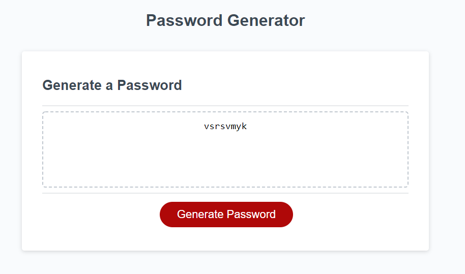
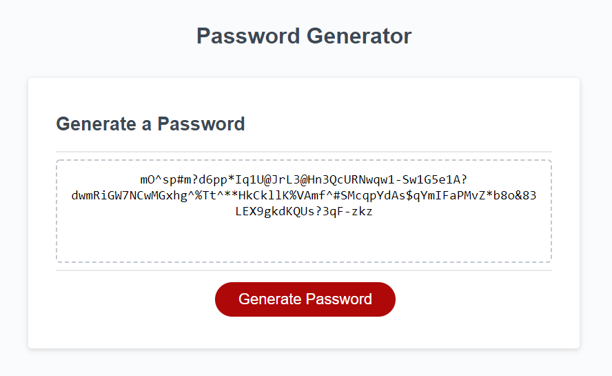

# Password Generator

## Description

This is a simple complete random password generator that can generate any password length between 8 and 128. You can choose between having lowercase, uppercase, numbers and even have special characters in your password! You can get a super simple password with only lowercase and 8 characters in length. If you want to have that extra protection with a strong password you could generate a password with all of them together up to 128 character! Who would be able to guess a password like that! The choice is all yours.

## Random Password Generator Links

[Live Website](https://tyestanley.github.io/password-generator/)

[Repository](https://github.com/TyeStanley/password-generator)

## Random Password Generator Showcase
A password with 8 characters with only lowercase:

Want some extreme security? Try this one out.

## License

 MIT License

Copyright (c) 2022 Tye Stanley

Permission is hereby granted, free of charge, to any person obtaining a copy
of this software and associated documentation files (the "Software"), to deal
in the Software without restriction, including without limitation the rights
to use, copy, modify, merge, publish, distribute, sublicense, and/or sell
copies of the Software, and to permit persons to whom the Software is
furnished to do so, subject to the following conditions:

The above copyright notice and this permission notice shall be included in all
copies or substantial portions of the Software.

THE SOFTWARE IS PROVIDED "AS IS", WITHOUT WARRANTY OF ANY KIND, EXPRESS OR
IMPLIED, INCLUDING BUT NOT LIMITED TO THE WARRANTIES OF MERCHANTABILITY,
FITNESS FOR A PARTICULAR PURPOSE AND NONINFRINGEMENT. IN NO EVENT SHALL THE
AUTHORS OR COPYRIGHT HOLDERS BE LIABLE FOR ANY CLAIM, DAMAGES OR OTHER
LIABILITY, WHETHER IN AN ACTION OF CONTRACT, TORT OR OTHERWISE, ARISING FROM,
OUT OF OR IN CONNECTION WITH THE SOFTWARE OR THE USE OR OTHER DEALINGS IN THE
SOFTWARE.